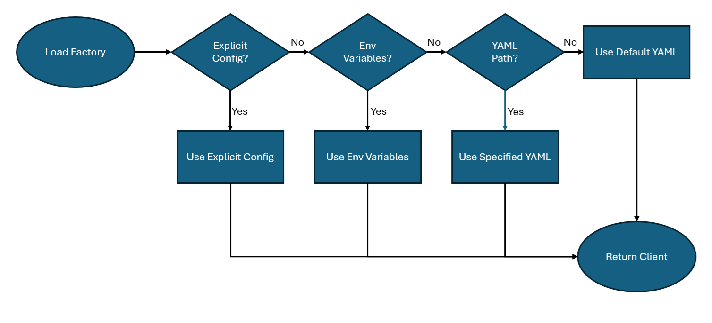
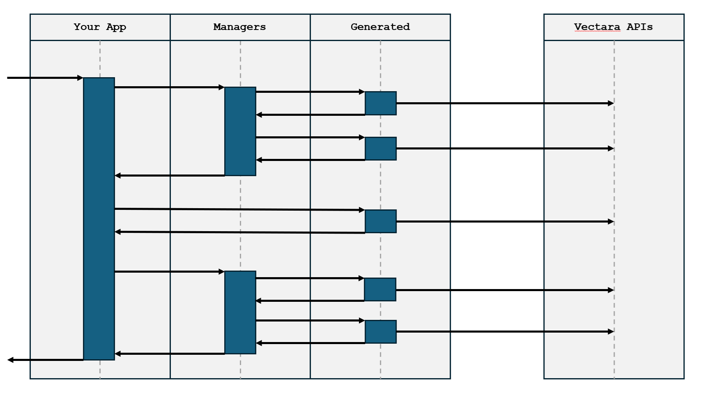

# Vectara Python Library

[](https://buildwithfern.com?utm_source=github&utm_medium=github&utm_campaign=readme&utm_source=https%3A%2F%2Fgithub.com%2Fvectara%2Fpython-sdk)
[](https://pypi.python.org/pypi/vectara)

The Vectara Python library provides convenient access to the Vectara API from Python.

## Installation

```sh
pip install vectara
```

### Using the SDK in Different Contexts
The Python library is designed to run in a number of environments with different requirements:

1. **Notebooks** - using implicit configuration from a users home directory
2. **Docker Environments** - using ENV variables for configuration
3. **Complex Applications** - allowing explicit configuration from mutable stores (e.g. RDBMS / NoSQL)

In order to satisfy this requirement, the client can be instantiated a few different ways:

1. Explicit Configuration
2. Environment Variables
3. Explicit Path to YAML file
4. Default YAML in home directory



### Explicit Configuration
To create an instance of vectara.Client with Explicit Configuration any of the
following methods.

#### Configuration as a Python Dict
We can specify a dict which matches vectara.config.ClientConfig

```python
# API Key Example
config = {
    "customer_id": "foo", # Customer ID no longer needed but left in for now
    "auth": {
        "api_key": "YOUR API KEY"
    }
}

# OAuth2 Example
config = {
    "customer_id": "foo", # Customer ID no longer needed but left in for now
    "auth": {
        "app_client_id": "OAuth2 application client id",
        "app_client_secret": "OAuth2 application client secret"
    }
}

client = Factory(config=config).build()
```
#### Configuration as a Pydantic ClientConfig
You can also use a Pydantic well type configuration via `vectara.config.ClientConfig`.
```python
config = ClientConfig.model_validate({...})
client = Factory(config=config).build()
```

### Environment Based Configuration
When running in Docker environments, it is useful to initialize Vectara using
environment variables. If you want to do this, please set the following, using either API Key or both of the
OAuth2 properties:

| Environment Variable | Description |
|----------------------|-------------|
| **VECTARA_CUSTOMER_ID** | The customer id for the given Account |
| **VECTARA_API_KEY** | The API key |
| **VECTARA_CLIENT_ID** | The OAuth2 Client ID |
| **VECTARA_CLIENT_SECRET** | The OAuth2 Client Secret |

If the client is built via the Factory with these present and not explicit configuration,
these will be used to configure the `vectara.Vectara` client.

### YAML Based Configuration
When using Vectara in shareable notebooks, it is desirable to remove any
sensitive keys from the Notebook cells to prevent committing this to a repository
or sharing inadvertently. To meet this need, we also have the YAML method of configuration.

By default, when configured with no arguments, the system will look for a file `.vec_auth.yaml`
in the users home directory. If there is another location for the YAML file, it can be
specified with the `config_path` parameter to the `vectara.Factory` initialization.

```
# Default from the users home directory.
client = Factory().build()

# Explict path referenced
client = Factory(config_path="/my/vectara/config.yaml").build()
```

#### YAML Configuration Format
The configuration format should like below. You can define multiple configuration blocks. If not specified,
the factory will load the profile "default". You must specify your customer_id but may 

```yaml
default:
  customer_id : "1999999999"
  auth:
    # For API Key, you only need the API key
    api_key : "abcdabcdabcdabcdabcdabcdababcdabcd"
admin:
  customer_id : "1999999999" # Customer Id as a string
  auth:
    # For OAuth2, you need app_client_id, app_client_secret, auth_url
    app_client_id : "abcdabcdabcdabcdabcdabcdab"
    app_client_secret : "abcdabcdabcdabcdabcdabcdababcdabcdabcdabcdabcdabcdab"
    # This is optional, you can leave this blank in most circumstances
    auth_url : "https://vectara-prod-YOUR_CUSTOMER_ID.auth.us-west-2.amazoncognito.com/oauth2/token"
```

#### Multiple Profiles
You can load other configuration profiles using the property profile on the build command.

```python
from vectara.factory import Factory
client = Factory(profile="admin").build()
```

### Managers vs Direct API methods
This API was generated by FERN, but in some cases you want to perform operations at a "higher level of abstraction"
that may comprise multiple method calls. There's also many convenience operations we can perform which are useful that may eventually make it into
the Vectara API. For example, we can URL encode the doc_id to support multiple languages which isn't (yet) in the
FERN generated code.



To that end, we have built and tested the following managers on top of the direct API methods. They are located
in the module vectara.managers. We have the following managers defined which
can be found on the client.

* [client.corpus_manager](./src/vectara/managers/corpus.py) - Provides abstractions over Corpus Methods
* [client.upload_manager](./src/vectara/managers/upload.py) - Provides abstractions over file Uploads

## Usage

Using the [implicit configuration](#YAML-Configuration-Format) method we
can create and run a query as follows.

```python
from vectara.factory import Factory

client = Factory().build()
client.query(
    query="Am I allowed to bring pets to work?"
)
```
More complete examples can be found in the [Getting Started notebooks](./examples/01_getting_started).


## API Generated Documentation
API reference documentation is available [here](https://vectara.docs.buildwithfern.com/).

## Exception Handling

When the API returns a non-success status code (4xx or 5xx response), a subclass of the following error
will be thrown.

```python
from vectara.core.api_error import ApiError

try:
    client.query(...)
except ApiError as e:
    print(e.status_code)
    print(e.body)
```

## Streaming

The SDK supports streaming responses, as well, the response will be a generator that you can loop over.

```python
from vectara import (
    CitationParameters,
    ContextConfiguration,
    CustomerSpecificReranker,
    GenerationParameters,
    ModelParameters,
    Vectara,
)
from vectara.corpora import SearchCorpusParameters

client = Vectara(
    api_key="YOUR_API_KEY",
    client_id="YOUR_CLIENT_ID",
    client_secret="YOUR_CLIENT_SECRET",
)
response = client.corpora.query_stream(
    corpus_key="string",
    request_timeout=1,
    request_timeout_millis=1,
    query="string",
    search=SearchCorpusParameters(
        custom_dimensions={"string": 1.1},
        metadata_filter="string",
        lexical_interpolation=1.1,
        semantics="default",
        offset=1,
        limit=1,
        context_configuration=ContextConfiguration(
            characters_before=1,
            characters_after=1,
            sentences_before=1,
            sentences_after=1,
            start_tag="string",
            end_tag="string",
        ),
        reranker=CustomerSpecificReranker(
            reranker_id="string",
            reranker_name="string",
            limit=1,
            cutoff=1.1,
        ),
    ),
    generation=GenerationParameters(
        generation_preset_name="string",
        prompt_name="string",
        max_used_search_results=1,
        prompt_template="string",
        prompt_text="string",
        max_response_characters=1,
        response_language="auto",
        model_parameters=ModelParameters(
            max_tokens=1,
            temperature=1.1,
            frequency_penalty=1.1,
            presence_penalty=1.1,
        ),
        citations=CitationParameters(
            style="none",
            url_pattern="string",
            text_pattern="string",
        ),
        enable_factual_consistency_score=True,
    ),
)
for chunk in response:
    yield chunk
```

## Pagination

Paginated requests will return a `SyncPager` or `AsyncPager`, which can be used as generators for the underlying object.

```python
from vectara import Vectara

client = Vectara(
    api_key="YOUR_API_KEY",
    client_id="YOUR_CLIENT_ID",
    client_secret="YOUR_CLIENT_SECRET",
)
response = client.corpora.list(
    limit=1,
)
for item in response:
    yield item
# alternatively, you can paginate page-by-page
for page in response.iter_pages():
    yield page
```

## Advanced

### Retries

The SDK is instrumented with automatic retries with exponential backoff. A request will be retried as long
as the request is deemed retriable and the number of retry attempts has not grown larger than the configured
retry limit (default: 2).

A request is deemed retriable when any of the following HTTP status codes is returned:

- [408](https://developer.mozilla.org/en-US/docs/Web/HTTP/Status/408) (Timeout)
- [429](https://developer.mozilla.org/en-US/docs/Web/HTTP/Status/429) (Too Many Requests)
- [5XX](https://developer.mozilla.org/en-US/docs/Web/HTTP/Status/500) (Internal Server Errors)

Use the `max_retries` request option to configure this behavior.

```python
client.query(..., request_options={
    "max_retries": 1
})
```

### Timeouts

The SDK defaults to a 60 second timeout. You can configure this with a timeout option at the client or request level.

```python

from vectara import Vectara

client = Vectara(
    ...,
    timeout=20.0,
)


# Override timeout for a specific method
client.query(..., request_options={
    "timeout_in_seconds": 1
})
```

### Custom Client

You can override the `httpx` client to customize it for your use-case. Some common use-cases include support for proxies
and transports.
```python
import httpx
from vectara import Vectara

client = Vectara(
    ...,
    httpx_client=httpx.Client(
        proxies="http://my.test.proxy.example.com",
        transport=httpx.HTTPTransport(local_address="0.0.0.0"),
    ),
)
```

## Contributing

While we value open-source contributions to this SDK, this library is generated programmatically.
Additions made directly to this library would have to be moved over to our generation code,
otherwise they would be overwritten upon the next generated release. Feel free to open a PR as
a proof of concept, but know that we will not be able to merge it as-is. We suggest opening
an issue first to discuss with us!

On the other hand, contributions to the README are always very welcome!
